# Караяни Елена Ивановна, ИС 22-9-1

## 2. Описание БД.

Базы данных ветеренарной клиники,в него входят 9 таблиц:

1)animals(диагнозы и животных);

2)client(ФИО клиентов и их животные);

3)diagnoses(вид болезни и название лекарств);

4)doctors(данные о врачах);

5)entry(запись);

6)medicines(лекарства);

7)offices(кабинеты);

8)services(услуги);

9)specialization(специализации);

## 2.1. Описание атрибутов.

    ANIMALS. Имеет столбцы:
    
1)id(айдишник таблицы, настроен по умолчанию, int);

2)id_diagnoses(диагноз, integer);

3)title(название животных, text);

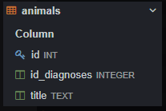
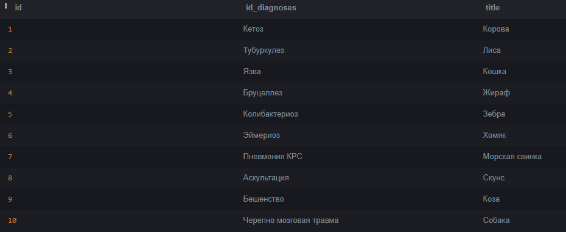

    CLIENT. Имеет столбцы:
1)id(айдишник таблицы, настроен по умолчанию, int);

2)id_animals(айти животного, integer);

3)full_Name_And_Animals(ФИО клиента и их животное, text);

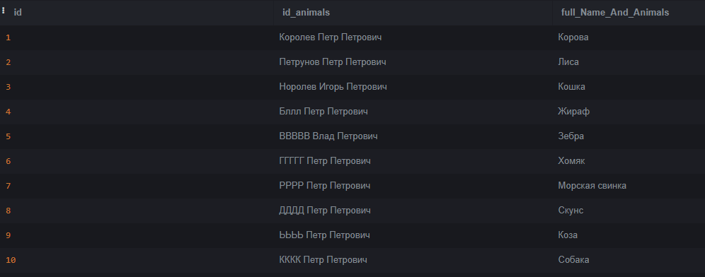

    DIAGNOSES. Имеет столбцы:
    
1)id(айдишник таблицы, настроен по умолчанию, int);

2)id_medicines(диагнозы животных, integer);

3)title(название лекарств, text);

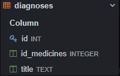
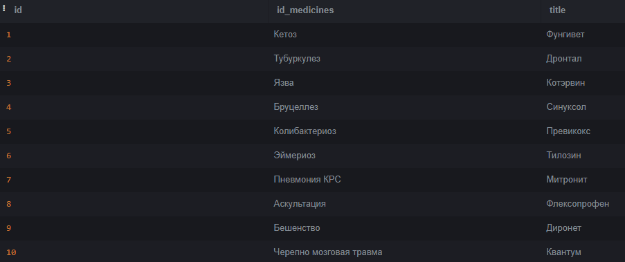

    DOCTORS. Имеет столбцы:
    
1)id(айдишник таблицы, настроен по умолчанию, int);

2)id_offices(айти офиса, integer);

3)id_specialization(специализация врачей, integer);

4)full_Name(ФИО врачей, text);

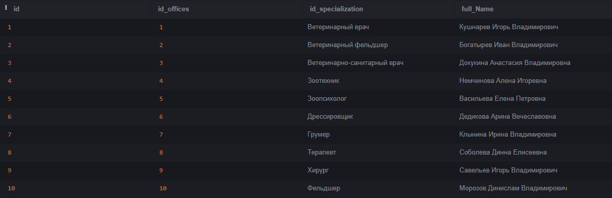

    ENTRY. Имеет столбцы:
    
1)id(айдишник таблицы, настроен по умолчанию, int);

2)id_animals(айти животного, integer);

3)id_services(айти услуги, integer);

4)id_client(айти клиента, integer);

5)id_doctors(айти докторов, integer);

6)queue(очередь, int);

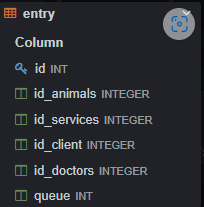
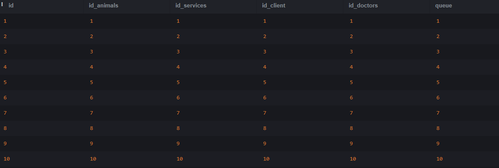

    MEDICINES. Имеет столюцы:
    
1)id(айдишник таблицы, настроен по умолчанию, int);

2)title(название лекарств, text);

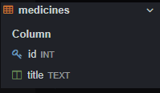
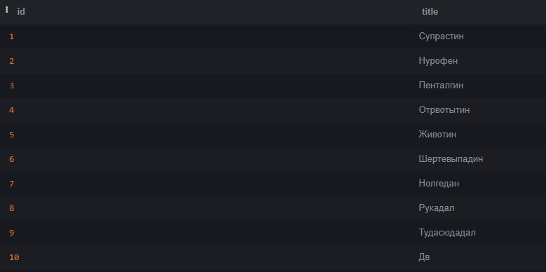

    OFFICES. Имеет столбцы:
    
1)id(айдишник таблицы, настроен по умолчанию, int);

2)number(номера кабинетов, text);

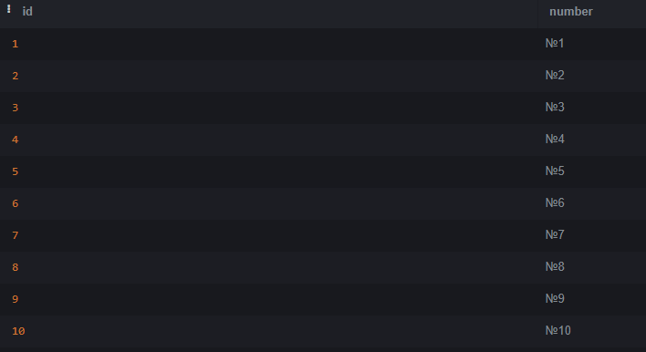

    SERVICES. Имеет столбцы:
    
1)id(айдишник таблицы, настроен по умолчанию, int);

2)title(название услуг, text);

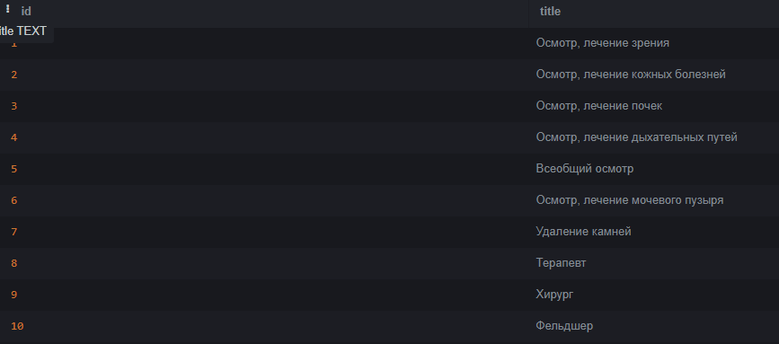

    SPECIALIZATION. Имеет столбцы:
    
1)id(айдишник таблицы, настроен по умолчанию, int);

2)title(название специализаций, text);

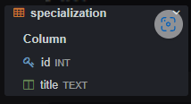
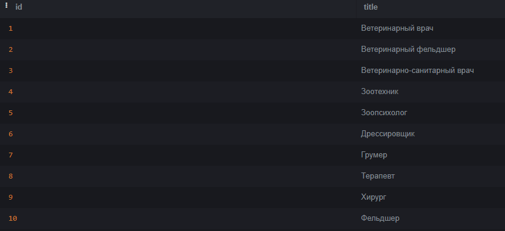

## 3. Описание функции UNION.

- UNION -  объединяет двух наборов строк id_diagnoses и title возвращаемых SQL-запросами.

## 4. Описание функции ORDER BY.

- ORDER BY - оператор, который отвечает за группировку данных.

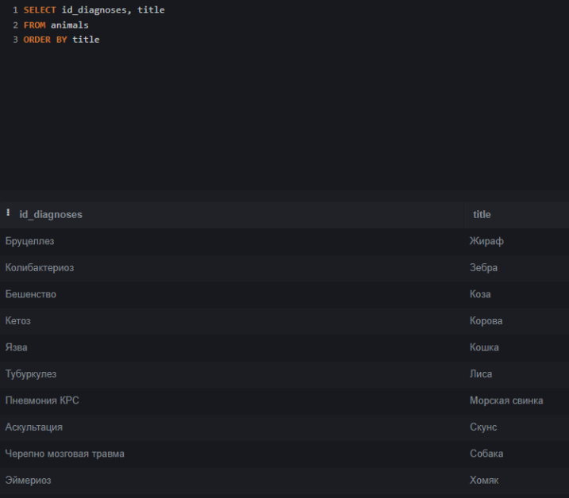

## 5. Описание функции HAVING.

- HAVING -  получения данных из таблицы animals, соответствующих определённым значениям результатов, возвращаемых агрегатными функциями.

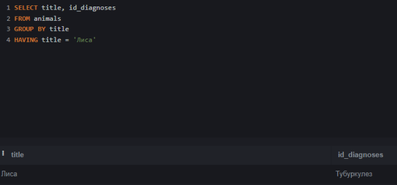

## 6. Описание функции вложеных запросовю 

-

## 7. Описание работ оконных функций.

-

## 8. Описание работы JOIN.

-

## 9. Описание работы функции CASE.

-

## 10. 

