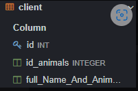
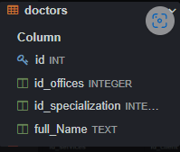
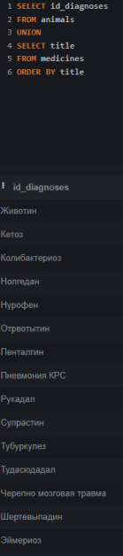

# Караяни Елена Ивановна, ИС 22-9-1

## 2. Описание БД.

Базы данных ветеренарной клиники,в него входят 9 таблиц:

1)animals(диагнозы и животных);

2)client(ФИО клиентов и их животные);

3)diagnoses(вид болезни и название лекарств);

4)doctors(данные о врачах);

5)entry(запись);

6)medicines(лекарства);

7)offices(кабинеты);

8)services(услуги);

9)specialization(специализации);


## 2.1. Описание атрибутов.

1. ## ANIMALS. 
    
1)id(айдишник таблицы, настроен по умолчанию, int);

2)id_diagnoses(диагноз, integer);

3)title(название животных, text);


2. ## CLIENT. 
1)id(айдишник таблицы, настроен по умолчанию, int);

2)id_animals(айти животного, integer);

3)full_Name_And_Animals(ФИО клиента и их животное, text);





3. ## DIAGNOSES. 
    
1)id(айдишник таблицы, настроен по умолчанию, int);

2)id_medicines(диагнозы животных, integer);

3)title(название лекарств, text);


4. ## DOCTORS.
    
1)id(айдишник таблицы, настроен по умолчанию, int);

2)id_offices(айти офиса, integer);

3)id_specialization(специализация врачей, integer);

4)full_Name(ФИО врачей, text);





5. ## ENTRY. 
    
1)id(айдишник таблицы, настроен по умолчанию, int);

2)id_animals(айти животного, integer);

3)id_services(айти услуги, integer);

4)id_client(айти клиента, integer);

5)id_doctors(айти докторов, integer);

6)queue(очередь, int);


6. ## MEDICINES.
    
1)id(айдишник таблицы, настроен по умолчанию, int);

2)title(название лекарств, text);


7. ## OFFICES. 
    
1)id(айдишник таблицы, настроен по умолчанию, int);

2)number(номера кабинетов, text);


8. ## SERVICES. 
    
1)id(айдишник таблицы, настроен по умолчанию, int);

2)title(название услуг, text);


9. ## SPECIALIZATION. 
    
1)id(айдишник таблицы, настроен по умолчанию, int);

2)title(название специализаций, text);


## 3. Описание функции UNION.

- UNION -  объединяет двух наборов строк id_diagnoses и title возвращаемых SQL-запросами.
```
SELECT id_diagnoses
FROM animals
UNION
SELECT title
FROM medicines
ORDER BY title
```



## 4. Описание функции ORDER BY.

- ORDER BY - оператор, который отвечает за группировку данных.
```
SELECT id_diagnoses, title
FROM animals
ORDER BY title
```


## 5. Описание функции HAVING.

- HAVING -  получения данных из таблицы animals, соответствующих определённым значениям результатов, возвращаемых агрегатными функциями.

```
SELECT title, id_diagnoses
FROM animals
GROUP BY title
HAVING title = 'Лиса'
```


## 6. Описание функции вложеных запросов.

- Вместо условия используется вложенный запрос.

```
SELECT title, id_diagnoses
FROM animals
WHERE title = (SELECT title FROM animals
               WHERE title = 'Лиса')
```


## 7. Описание работ оконных функций.
# 7.1 Агрегатные функции.
- Скрин 1, выводит препорат с самым длинным названием. 
- Скрин 2, выводит препорат с самым коротким названием.
- Скрин 3, выводит общее количество животных.
```
SELECT MAX(LENGTH(title)) AS Препорат_с_самым_длинным_названием 
FROM medicines
```


```
SELECT MIN(LENGTH(title)) AS Препорат_с_самым_коротким_названием 
FROM medicines
```


```
SELECT COUNT(title) AS количество_животных
FROM medicines
```


# 7.2. Ранжерующие функции.
- возвращают значение для каждой строки группы в результирующем наборе данных.
```
SELECT id,
	id_offices,
	full_name,
	ROW_NUMBER() OVER(PARTITION BY id_offices ORDER BY full_name),
	RANK() OVER(PARTITION BY id_offices ORDER BY full_name)
FROM doctors;
```


# 7.3 Функции смещения.
- функции, которые позволяют перемещаться и обращаться к разным строкам в окне.
```
SELECT id,
	id_offices,
    full_name,
	LAG(full_name) OVER(PARTITION BY id_offices ORDER BY full_name)
FROM doctors;
```

```
SELECT id,
	id_offices,
    full_name,
	LEAD(full_name) OVER(PARTITION BY id_offices ORDER BY full_name)
FROM doctors;
```

```
SELECT id,
	id_offices,
    full_name,
	FIRST_VALUE(id_offices) OVER(PARTITION BY full_name ORDER BY id_offices) AS FIRST_VALUE
FROM doctors;
```

```
SELECT id,
	id_offices,
    full_name,
	LAST_VALUE(id) OVER(PARTITION BY full_name ORDER BY id) AS LAST_VALUE
FROM doctors;
```


## 8. Описание работы JOIN.

-  Объединяет данные из двух разных таблиц в базе. Цель использования команды — получить нужное подмножество данных.

# 8.1. Inner Join 
- внутреннее объединение
```
SELECT entry.id, services.title
FROM entry
JOIN services ON entry.id_services = services.id
```


# 8.2. Left Join.

- возвращает пересечение множеств и все элементы из левой таблицы;
```
SELECT doctors.id, doctors.id_specialization, offices.id
FROM doctors
LEFT JOIN offices ON doctors.id_offices = offices.id
```


# 8.3. Right Join.

-  работает по тому же принципу, но вместо левой таблицы — правая;
```
SELECT doctors.id, doctors.id_specialization, offices.id
FROM doctors
RIGHT JOIN offices ON doctors.id_offices = offices.id
```


## 9. Описание работы функции CASE.

- оператор позволяет осуществить проверку условий и возвратить в зависимости от выполнения того или иного условия тот или иной результат.
```
SELECT title,
CASE
WHEN title = 'Кошка' THEN 'МЯЯЯЯЯЯУ'
WHEN title = 'Собака' THEN 'ГАААВ ГАВ'
WHEN title = 'Корова' THEN 'Муууу'
ELSE 'НЕ ЗНАЮ'
END as ЧТО_ОНО_ГОВОРИТ
FROM animals
```


## 10.  Описание работы функции WITH.

- используется для создания временных таблиц, которые можно использовать внутри запросов.(у нас это drip).
```
WITH Drip AS
(SELECT id_diagnoses, title FROM animals)
SELECT * FROM Drip
```

